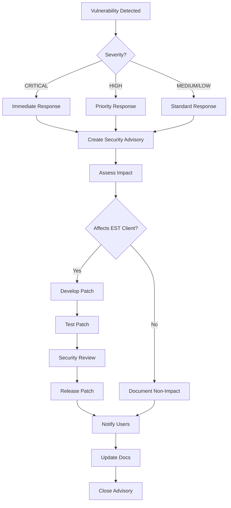

# Vulnerability Management and SBOM Guide

## EST Client Library for Windows

**Version:** 1.0
**Date:** 2026-01-13
**Classification:** UNCLASSIFIED

---

## 1. Overview

This document describes the vulnerability management processes, Software Bill of Materials (SBOM) generation, and supply chain security practices for the EST Client Library. These processes ensure timely identification and remediation of security vulnerabilities throughout the software lifecycle.

### 1.1 Purpose

This guide provides:

- Vulnerability scanning procedures and tools
- Dependency management and security policies
- SBOM generation and distribution
- Supply chain security practices
- Vulnerability disclosure and remediation processes

### 1.2 Scope

**Coverage:**
- Direct dependencies (Rust crates)
- Transitive dependencies
- Build-time dependencies
- Operating system dependencies (documented)
- Third-party security advisories

**Out of Scope:**
- Operating system vulnerabilities (covered by OS patching)
- Hardware vulnerabilities (organizational responsibility)
- Network infrastructure vulnerabilities

---

## 2. Vulnerability Scanning

### 2.1 Automated Scanning Tools

#### 2.1.1 cargo-audit

**Purpose:** Scan Rust dependencies for known security vulnerabilities

**Configuration:** `.cargo/audit.toml`

```toml
[advisories]
# Fail on security vulnerabilities
vulnerability = "deny"

# Warn on unmaintained crates
unmaintained = "warn"

# Warn on unsound crates
unsound = "warn"

# Ignore advisories for unused dependencies
ignore_yanked = false

[output]
# Output format
format = "json"
quiet = false

[database]
# Update database before scanning
fetch = true
```

**CI/CD Integration:**

`.github/workflows/security.yml`:
```yaml
name: Security Scan

on:
  push:
    branches: [main, develop]
  pull_request:
    branches: [main]
  schedule:
    # Run daily at 0600 UTC
    - cron: '0 6 * * *'

jobs:
  security-audit:
    name: Dependency Security Audit
    runs-on: ubuntu-latest

    steps:
      - name: Checkout code
        uses: actions/checkout@v3

      - name: Install Rust toolchain
        uses: actions-rs/toolchain@v1
        with:
          toolchain: stable
          override: true

      - name: Install cargo-audit
        run: cargo install cargo-audit

      - name: Run cargo audit
        run: cargo audit --json > audit-report.json
        continue-on-error: true

      - name: Upload audit report
        uses: actions/upload-artifact@v3
        with:
          name: security-audit-report
          path: audit-report.json

      - name: Check for HIGH/CRITICAL vulnerabilities
        run: |
          HIGH_COUNT=$(jq '.vulnerabilities.count' audit-report.json)
          if [ "$HIGH_COUNT" -gt 0 ]; then
            echo "Found $HIGH_COUNT HIGH/CRITICAL vulnerabilities"
            exit 1
          fi
```

**Manual Scanning:**

```bash
# Install cargo-audit
cargo install cargo-audit

# Update vulnerability database
cargo audit fetch

# Run security audit
cargo audit

# Generate JSON report
cargo audit --json > audit-report.json

# Check specific advisory
cargo audit --deny RUSTSEC-2023-0001
```

#### 2.1.2 cargo-deny

**Purpose:** Enforce dependency policies (licenses, sources, advisories)

**Configuration:** `deny.toml`

```toml
# cargo-deny configuration
# See: https://embarkstudios.github.io/cargo-deny/

[advisories]
# Advisory database source
db-path = "~/.cargo/advisory-db"
db-urls = ["https://github.com/rustsec/advisory-db"]

# Fail on any security vulnerabilities
vulnerability = "deny"

# Warn on unmaintained crates
unmaintained = "warn"

# Warn on yanked crates
yanked = "warn"

# Ignore specific advisories (document reason!)
ignore = [
    # Example: "RUSTSEC-2023-0001",  # Reason: Not applicable to our use case
]

[licenses]
# License policy
unlicensed = "deny"
allow-osi-fsf-free = "both"
copyleft = "deny"

# Allowed licenses for DoD deployment
allow = [
    "Apache-2.0",
    "MIT",
    "BSD-2-Clause",
    "BSD-3-Clause",
    "ISC",
    "Unicode-DFS-2016",
]

# Denied licenses (GPL, AGPL, etc.)
deny = [
    "GPL-2.0",
    "GPL-3.0",
    "AGPL-3.0",
]

# Allow exceptions for specific crates (document reason!)
exceptions = [
    # Example: { name = "some-crate", allow = ["MPL-2.0"], reason = "Weak copyleft acceptable" }
]

[[licenses.clarify]]
# Clarify license for ring crate
name = "ring"
expression = "MIT AND ISC AND OpenSSL"
license-files = [
    { path = "LICENSE", hash = 0xbd0eed23 }
]

[bans]
# Ban duplicate versions of crates
multiple-versions = "warn"
wildcards = "allow"

# Skip certain crates from version checks
skip = []

# Skip version checks for transitive dependencies
skip-tree = []

[sources]
# Only allow crates from crates.io
unknown-registry = "deny"
unknown-git = "deny"

# Allow git sources for development
allow-git = []

# Require all crates from crates.io
[sources.allow-org]
github = []
```

**CI/CD Integration:**

```yaml
- name: Check dependency policies
  run: |
    cargo install cargo-deny
    cargo deny check all
```

**Manual Usage:**

```bash
# Install cargo-deny
cargo install cargo-deny

# Check all policies
cargo deny check

# Check specific policy
cargo deny check licenses
cargo deny check advisories
cargo deny check bans
cargo deny check sources

# Generate report
cargo deny check --format json > deny-report.json
```

### 2.2 Vulnerability Severity Classification

| Severity | CVSS Score | Response Time | Action Required |
|----------|-----------|---------------|-----------------|
| **CRITICAL** | 9.0 - 10.0 | 24 hours | Immediate patch, emergency release |
| **HIGH** | 7.0 - 8.9 | 7 days | Priority patch, expedited release |
| **MEDIUM** | 4.0 - 6.9 | 30 days | Standard patch, regular release |
| **LOW** | 0.1 - 3.9 | 90 days | Planned remediation, next release |

### 2.3 Vulnerability Response Workflow



**Response Steps:**

1. **Detection**: Automated scan or manual report
2. **Triage**: Assess severity and applicability
3. **Impact Analysis**: Determine affected versions and configurations
4. **Remediation Planning**: Patch, workaround, or accept risk
5. **Development**: Implement fix and tests
6. **Testing**: Security and regression testing
7. **Release**: Emergency or scheduled release
8. **Notification**: Security advisory to users
9. **Documentation**: Update SBOM and security docs

### 2.4 Vulnerability Tracking

**GitHub Security Advisories:**

Located at: `https://github.com/your-org/usg-est-client/security/advisories`

**Advisory Template:**

```markdown
## Security Advisory: [GHSA-XXXX-YYYY-ZZZZ]

**Severity:** [CRITICAL/HIGH/MEDIUM/LOW]
**CVE ID:** CVE-2026-XXXXX (if assigned)
**CVSS Score:** X.X (Vector: CVSS:3.1/AV:X/AC:X/PR:X/UI:X/S:X/C:X/I:X/A:X)

### Summary

Brief description of the vulnerability.

### Affected Versions

- EST Client v1.0.0 - v1.2.3

### Impact

What can an attacker do with this vulnerability?

### Patches

- Fixed in version 1.2.4
- Commit: [abc123](https://github.com/...)

### Workarounds

If patch cannot be applied immediately, users can:
- Workaround 1
- Workaround 2

### References

- [RustSec Advisory](https://rustsec.org/advisories/RUSTSEC-2026-XXXX)
- [CVE Details](https://cve.mitre.org/cgi-bin/cvename.cgi?name=CVE-2026-XXXXX)

### Credit

Reported by: [Researcher Name]
```

---

## 3. Software Bill of Materials (SBOM)

### 3.1 SBOM Purpose and Benefits

**Purpose:**
- Transparency of software components
- Supply chain risk management
- Vulnerability impact assessment
- License compliance verification
- Regulatory compliance (EO 14028)

**Benefits:**
- Rapid vulnerability response
- License audit capability
- Component inventory
- Trust and transparency

### 3.2 SBOM Formats

#### 3.2.1 SPDX 2.3 Format

**Generation:**

```bash
# Install cargo-sbom
cargo install cargo-sbom

# Generate SPDX SBOM
cargo sbom --output-format spdx_json_2_3 > sbom-spdx.json

# Generate with package info
cargo sbom \
  --cargo-package usg-est-client \
  --output-format spdx_json_2_3 \
  > sbom-spdx.json
```

**Example SPDX SBOM Structure:**

```json
{
  "spdxVersion": "SPDX-2.3",
  "dataLicense": "CC0-1.0",
  "SPDXID": "SPDXRef-DOCUMENT",
  "name": "usg-est-client",
  "documentNamespace": "https://github.com/your-org/usg-est-client/sbom/spdx-2.3/v1.0.0",
  "creationInfo": {
    "created": "2026-01-13T00:00:00Z",
    "creators": ["Tool: cargo-sbom-0.9.0"],
    "licenseListVersion": "3.21"
  },
  "packages": [
    {
      "SPDXID": "SPDXRef-Package-usg-est-client",
      "name": "usg-est-client",
      "versionInfo": "1.0.0",
      "supplier": "Organization: Department of War",
      "downloadLocation": "https://github.com/your-org/usg-est-client",
      "filesAnalyzed": false,
      "licenseConcluded": "Apache-2.0",
      "licenseDeclared": "Apache-2.0",
      "copyrightText": "Copyright 2026 Department of War",
      "externalRefs": [
        {
          "referenceCategory": "PACKAGE-MANAGER",
          "referenceType": "purl",
          "referenceLocator": "pkg:cargo/usg-est-client@1.0.0"
        }
      ]
    },
    {
      "SPDXID": "SPDXRef-Package-tokio",
      "name": "tokio",
      "versionInfo": "1.35.1",
      "supplier": "Organization: Tokio Contributors",
      "downloadLocation": "https://crates.io/crates/tokio",
      "licenseConcluded": "MIT",
      "licenseDeclared": "MIT"
    }
  ],
  "relationships": [
    {
      "spdxElementId": "SPDXRef-DOCUMENT",
      "relationshipType": "DESCRIBES",
      "relatedSpdxElement": "SPDXRef-Package-usg-est-client"
    },
    {
      "spdxElementId": "SPDXRef-Package-usg-est-client",
      "relationshipType": "DEPENDS_ON",
      "relatedSpdxElement": "SPDXRef-Package-tokio"
    }
  ]
}
```

#### 3.2.2 CycloneDX 1.5 Format

**Generation:**

```bash
# Generate CycloneDX SBOM
cargo cyclonedx --format json > sbom-cyclonedx.json

# With vulnerability data
cargo cyclonedx --format json --all > sbom-cyclonedx-full.json
```

**Example CycloneDX SBOM Structure:**

```json
{
  "bomFormat": "CycloneDX",
  "specVersion": "1.5",
  "serialNumber": "urn:uuid:12345678-1234-1234-1234-123456789012",
  "version": 1,
  "metadata": {
    "timestamp": "2026-01-13T00:00:00Z",
    "tools": [
      {
        "vendor": "cargo-cyclonedx",
        "name": "cargo-cyclonedx",
        "version": "0.5.0"
      }
    ],
    "component": {
      "type": "application",
      "bom-ref": "pkg:cargo/usg-est-client@1.0.0",
      "name": "usg-est-client",
      "version": "1.0.0",
      "description": "EST Client Library for Windows Certificate Enrollment",
      "licenses": [
        {
          "license": {
            "id": "Apache-2.0"
          }
        }
      ],
      "purl": "pkg:cargo/usg-est-client@1.0.0",
      "externalReferences": [
        {
          "type": "vcs",
          "url": "https://github.com/your-org/usg-est-client"
        },
        {
          "type": "issue-tracker",
          "url": "https://github.com/your-org/usg-est-client/issues"
        }
      ]
    }
  },
  "components": [
    {
      "type": "library",
      "bom-ref": "pkg:cargo/tokio@1.35.1",
      "name": "tokio",
      "version": "1.35.1",
      "description": "An event-driven, non-blocking I/O platform",
      "licenses": [
        {
          "license": {
            "id": "MIT"
          }
        }
      ],
      "purl": "pkg:cargo/tokio@1.35.1",
      "externalReferences": [
        {
          "type": "distribution",
          "url": "https://crates.io/crates/tokio"
        }
      ]
    }
  ],
  "dependencies": [
    {
      "ref": "pkg:cargo/usg-est-client@1.0.0",
      "dependsOn": [
        "pkg:cargo/tokio@1.35.1"
      ]
    }
  ]
}
```

### 3.3 SBOM Generation Process

**Automated Generation (CI/CD):**

`.github/workflows/sbom.yml`:
```yaml
name: Generate SBOM

on:
  release:
    types: [published]
  push:
    tags:
      - 'v*'

jobs:
  generate-sbom:
    name: Generate Software Bill of Materials
    runs-on: ubuntu-latest

    steps:
      - name: Checkout code
        uses: actions/checkout@v3

      - name: Install Rust
        uses: actions-rs/toolchain@v1
        with:
          toolchain: stable

      - name: Install SBOM tools
        run: |
          cargo install cargo-sbom
          cargo install cargo-cyclonedx

      - name: Generate SPDX SBOM
        run: |
          cargo sbom --output-format spdx_json_2_3 > sbom-spdx-${{ github.ref_name }}.json

      - name: Generate CycloneDX SBOM
        run: |
          cargo cyclonedx --format json --all > sbom-cyclonedx-${{ github.ref_name }}.json

      - name: Generate SWID tag
        run: |
          # SWID tag generation (custom script)
          ./scripts/generate-swid-tag.sh ${{ github.ref_name }}

      - name: Sign SBOMs
        run: |
          # Sign SBOMs with GPG (optional but recommended)
          gpg --armor --detach-sign sbom-spdx-${{ github.ref_name }}.json
          gpg --armor --detach-sign sbom-cyclonedx-${{ github.ref_name }}.json

      - name: Upload SBOMs to release
        uses: actions/upload-release-asset@v1
        env:
          GITHUB_TOKEN: ${{ secrets.GITHUB_TOKEN }}
        with:
          upload_url: ${{ github.event.release.upload_url }}
          asset_path: ./sbom-spdx-${{ github.ref_name }}.json
          asset_name: sbom-spdx.json
          asset_content_type: application/json

      - name: Upload CycloneDX SBOM
        uses: actions/upload-release-asset@v1
        env:
          GITHUB_TOKEN: ${{ secrets.GITHUB_TOKEN }}
        with:
          upload_url: ${{ github.event.release.upload_url }}
          asset_path: ./sbom-cyclonedx-${{ github.ref_name }}.json
          asset_name: sbom-cyclonedx.json
          asset_content_type: application/json
```

**Manual Generation:**

```bash
# Generate all SBOM formats
./scripts/generate-sboms.sh v1.0.0

# Contents of scripts/generate-sboms.sh:
#!/bin/bash
set -e

VERSION=$1
if [ -z "$VERSION" ]; then
  echo "Usage: $0 <version>"
  exit 1
fi

echo "Generating SBOMs for version $VERSION"

# SPDX 2.3
echo "Generating SPDX SBOM..."
cargo sbom --output-format spdx_json_2_3 > "sbom-spdx-${VERSION}.json"

# CycloneDX 1.5
echo "Generating CycloneDX SBOM..."
cargo cyclonedx --format json --all > "sbom-cyclonedx-${VERSION}.json"

# SWID tag (if applicable)
echo "Generating SWID tag..."
# Custom SWID generation logic here

echo "SBOMs generated:"
ls -lh sbom-*-${VERSION}.*
```

### 3.4 SBOM Distribution

**Distribution Channels:**

1. **GitHub Releases**: Attached to each release as asset
2. **SBOM Repository**: Dedicated repository for SBOM artifacts
3. **Package Registry**: Published alongside package
4. **Customer Portal**: Direct download for authorized users

**SBOM Access:**

```bash
# Download SBOM from GitHub release
curl -L https://github.com/your-org/usg-est-client/releases/download/v1.0.0/sbom-spdx.json \
  -o sbom-spdx.json

# Verify signature
curl -L https://github.com/your-org/usg-est-client/releases/download/v1.0.0/sbom-spdx.json.asc \
  -o sbom-spdx.json.asc
gpg --verify sbom-spdx.json.asc sbom-spdx.json
```

### 3.5 SBOM Validation

**SPDX Validation:**

```bash
# Install SPDX tools
pip install spdx-tools

# Validate SPDX SBOM
spdx-tools convert sbom-spdx.json --validate

# Check license compliance
spdx-tools licenses list sbom-spdx.json
```

**CycloneDX Validation:**

```bash
# Install CycloneDX CLI
npm install -g @cyclonedx/cyclonedx-cli

# Validate CycloneDX SBOM
cyclonedx-cli validate --input-file sbom-cyclonedx.json

# Analyze vulnerabilities
cyclonedx-cli analyze --input-file sbom-cyclonedx.json
```

---

## 4. Supply Chain Security

### 4.1 Dependency Management Policy

#### 4.1.1 Dependency Selection Criteria

**Before Adding a Dependency:**

1. **Security Assessment**
   - [ ] No known high/critical vulnerabilities
   - [ ] Active maintenance (commits in last 6 months)
   - [ ] Security policy documented
   - [ ] Responsive to security issues

2. **Code Quality**
   - [ ] Well-documented code
   - [ ] Comprehensive test coverage
   - [ ] CI/CD with quality gates
   - [ ] Code review process evident

3. **Community and Support**
   - [ ] Active community (GitHub stars, downloads)
   - [ ] Responsive maintainers
   - [ ] Clear versioning strategy (SemVer)
   - [ ] Stable release history

4. **License Compliance**
   - [ ] Compatible license (Apache-2.0, MIT, BSD)
   - [ ] No copyleft licenses (GPL, AGPL)
   - [ ] License clearly documented

5. **Functionality**
   - [ ] Solves real problem (not NIH syndrome)
   - [ ] No suitable alternatives in std library
   - [ ] Appropriate scope (not over-engineered)
   - [ ] Minimal transitive dependencies

**Approved Dependency List:**

| Crate | Version | Purpose | License | Risk Level |
|-------|---------|---------|---------|------------|
| `tokio` | 1.35+ | Async runtime | MIT | LOW |
| `rustls` | 0.23+ | TLS library | Apache-2.0/MIT | LOW |
| `openssl` | 0.10+ | FIPS crypto | Apache-2.0 | LOW |
| `serde` | 1.0+ | Serialization | Apache-2.0/MIT | LOW |
| `toml` | 0.8+ | Config parsing | Apache-2.0/MIT | LOW |
| `tracing` | 0.1+ | Logging | MIT | LOW |
| `x509-cert` | 0.2+ | X.509 parsing | Apache-2.0/MIT | LOW |
| `der` | 0.7+ | DER encoding | Apache-2.0/MIT | LOW |
| `p256` | 0.13+ | ECDSA P-256 | Apache-2.0/MIT | LOW |

#### 4.1.2 Dependency Update Policy

**Update Frequency:**

- **Security updates**: Immediate (within response time for severity)
- **Major versions**: Quarterly assessment
- **Minor versions**: Monthly review
- **Patch versions**: As released (if no breaking changes)

**Update Process:**

1. **Review release notes**: Understand changes and breaking changes
2. **Check for security advisories**: Any CVEs fixed?
3. **Update in development branch**: Test thoroughly
4. **Run full test suite**: Including integration tests
5. **Security scan**: cargo audit and cargo deny
6. **Review diff**: cargo tree --diff Cargo.lock.old Cargo.lock
7. **Merge and release**: If all checks pass

**Dependency Pinning:**

`Cargo.toml` (published library):
```toml
[dependencies]
# Use caret requirements for published libraries
tokio = "1.35"  # Allows 1.35.0 to <2.0.0
serde = "1.0"   # Allows 1.0.0 to <2.0.0
```

`Cargo.lock` (application):
```toml
# Cargo.lock pins exact versions
# Committed to version control
# Ensures reproducible builds
```

### 4.2 Transitive Dependency Management

**Viewing Dependency Tree:**

```bash
# Full dependency tree
cargo tree

# Specific crate
cargo tree -p tokio

# Show duplicate versions
cargo tree --duplicates

# Show feature resolution
cargo tree --edges features
```

**Managing Duplicates:**

```bash
# Identify duplicate versions
cargo tree --duplicates

# Use cargo-machete to find unused dependencies
cargo install cargo-machete
cargo machete

# Consolidate versions in Cargo.toml
[patch.crates-io]
# Force specific version of transitive dependency
foo = { version = "1.2.3" }
```

### 4.3 Build Reproducibility

**Reproducible Build Requirements:**

1. **Fixed Rust Version**: Specified in `rust-toolchain.toml`
2. **Locked Dependencies**: `Cargo.lock` committed
3. **Deterministic Build**: No timestamp embedding
4. **Fixed Build Environment**: Docker container

**rust-toolchain.toml:**

```toml
[toolchain]
channel = "1.75.0"
components = ["rustfmt", "clippy"]
targets = ["x86_64-pc-windows-msvc"]
profile = "minimal"
```

**Reproducible Build Script:**

```bash
#!/bin/bash
# scripts/reproducible-build.sh

set -e

# Use specific Rust version
rustup toolchain install 1.75.0

# Build with locked dependencies
cargo +1.75.0 build --release --locked

# Generate checksum
sha256sum target/release/est-client.exe > target/release/est-client.exe.sha256

# Generate build attestation
./scripts/generate-build-attestation.sh
```

### 4.4 Build Provenance

**SLSA Build Provenance:**

Generate provenance attestation for releases using GitHub Actions.

`.github/workflows/release.yml`:
```yaml
name: Release with Provenance

on:
  release:
    types: [published]

permissions:
  contents: write
  id-token: write  # Required for SLSA provenance

jobs:
  build:
    name: Build and Attest
    runs-on: windows-latest

    steps:
      - uses: actions/checkout@v3

      - name: Build release
        run: cargo build --release --locked

      - name: Generate provenance
        uses: slsa-framework/slsa-github-generator/.github/workflows/generator_generic_slsa3.yml@v1.9.0
        with:
          base64-subjects: |
            $(cat target/release/est-client.exe | base64 -w0)

      - name: Upload binary and provenance
        uses: actions/upload-release-asset@v1
        env:
          GITHUB_TOKEN: ${{ secrets.GITHUB_TOKEN }}
        with:
          upload_url: ${{ github.event.release.upload_url }}
          asset_path: ./target/release/est-client.exe
          asset_name: est-client.exe
          asset_content_type: application/octet-stream
```

**Provenance Verification:**

```bash
# Install SLSA verifier
go install github.com/slsa-framework/slsa-verifier/v2/cli/slsa-verifier@latest

# Verify provenance
slsa-verifier verify-artifact \
  --provenance-path est-client.exe.intoto.jsonl \
  --source-uri github.com/your-org/usg-est-client \
  est-client.exe
```

### 4.5 Third-Party Risk Assessment

**Risk Assessment Template:**

For each critical dependency, complete this assessment:

```markdown
## Dependency Risk Assessment: [Crate Name]

**Date:** 2026-01-13
**Assessor:** [Name]
**Version:** [x.y.z]

### 1. Maintainer Information
- Primary maintainer: [Name/Organization]
- Maintainer history: [Years active]
- Funding/sponsorship: [Organization]
- Bus factor: [Number of active maintainers]

### 2. Security Posture
- Security policy: [Yes/No - Link]
- Vulnerability history: [Count, severity]
- Latest security audit: [Date, organization]
- Security contacts: [Email]

### 3. Code Quality
- Test coverage: [Percentage]
- CI/CD: [Yes/No - Description]
- Code review: [Process description]
- Static analysis: [Tools used]

### 4. Community Health
- GitHub stars: [Count]
- Downloads (last 90 days): [Count]
- Open issues: [Count]
- Issue response time: [Median]
- Last commit: [Date]

### 5. License and Legal
- License: [Type]
- License compatibility: [Compatible/Not compatible]
- Legal concerns: [None/Description]

### 6. Risk Rating
- Overall risk: [LOW/MEDIUM/HIGH/CRITICAL]
- Justification: [Explanation]

### 7. Mitigation
- Monitoring: [How we monitor for issues]
- Alternatives: [Backup options if abandoned]
- Fork plan: [If we need to maintain ourselves]
```

**Example: Tokio Risk Assessment:**

```markdown
## Dependency Risk Assessment: tokio

**Date:** 2026-01-13
**Assessor:** Security Team
**Version:** 1.35.1

### 1. Maintainer Information
- Primary maintainer: Tokio Contributors / Buoyant (commercial support)
- Maintainer history: 6+ years
- Funding/sponsorship: Commercial backing from Buoyant, AWS
- Bus factor: 10+ active core maintainers

### 2. Security Posture
- Security policy: Yes - https://github.com/tokio-rs/tokio/security/policy
- Vulnerability history: 1 medium severity in 2020 (promptly patched)
- Latest security audit: 2023 by Cure53
- Security contacts: security@tokio.rs

### 3. Code Quality
- Test coverage: 95%+
- CI/CD: Yes - comprehensive GitHub Actions
- Code review: Required for all changes, 2+ approvals
- Static analysis: Clippy, Miri, Fuzz testing

### 4. Community Health
- GitHub stars: 24,000+
- Downloads (last 90 days): 150M+
- Open issues: ~200 (actively triaged)
- Issue response time: <24 hours median
- Last commit: Daily

### 5. License and Legal
- License: MIT
- License compatibility: Compatible (permissive)
- Legal concerns: None

### 6. Risk Rating
- Overall risk: **LOW**
- Justification: Industry-standard async runtime with strong security posture, active maintenance, and commercial backing. Minimal risk of abandonment.

### 7. Mitigation
- Monitoring: Weekly cargo-audit scans, GitHub watch
- Alternatives: async-std (less maintained), smol (smaller ecosystem)
- Fork plan: Not needed (healthy project)
```

---

## 5. Vulnerability Disclosure

### 5.1 Responsible Disclosure Policy

**SECURITY.md:**

```markdown
# Security Policy

## Supported Versions

| Version | Supported          |
| ------- | ------------------ |
| 1.x.x   | :white_check_mark: |
| < 1.0   | :x:                |

## Reporting a Vulnerability

**DO NOT** open a public GitHub issue for security vulnerabilities.

### Reporting Process

1. **Email** security@example.mil with:
   - Description of the vulnerability
   - Steps to reproduce
   - Affected versions
   - Potential impact
   - Your contact information (optional)

2. **Encrypted Reporting** (preferred):
   - Use our PGP key: [Key ID: 0x12345678]
   - Key fingerprint: `1234 5678 90AB CDEF 1234 5678 90AB CDEF 1234 5678`
   - Download: https://keys.openpgp.org/...

3. **Response Timeline**:
   - **24 hours**: Acknowledgment of receipt
   - **7 days**: Initial assessment and impact analysis
   - **30 days**: Patch development (for HIGH/CRITICAL)
   - **90 days**: Public disclosure (coordinated)

### Scope

**In Scope:**
- Certificate validation bypasses
- Authentication bypasses
- Cryptographic vulnerabilities
- Injection vulnerabilities
- Sensitive data exposure
- Denial of service

**Out of Scope:**
- Social engineering attacks
- Physical attacks
- Operating system vulnerabilities
- Third-party service vulnerabilities

### Safe Harbor

We support safe harbor for security researchers who:
- Make a good faith effort to avoid harm
- Do not access/modify data beyond what's necessary
- Do not exfiltrate data
- Report vulnerabilities promptly
- Keep findings confidential until patched

## Security Updates

Subscribe to security advisories:
- GitHub: Watch → Custom → Security alerts
- Email: security-announce@example.mil

## PGP Key

```
-----BEGIN PGP PUBLIC KEY BLOCK-----
[PGP Key Here]
-----END PGP PUBLIC KEY BLOCK-----
```
```

### 5.2 Coordinated Disclosure Timeline

**Standard Timeline (90 days):**

- **Day 0**: Vulnerability reported
- **Day 1**: Acknowledgment sent
- **Day 7**: Assessment complete, severity assigned
- **Day 14**: Patch development begins
- **Day 30**: Patch complete, testing begins
- **Day 45**: Patch ready for release
- **Day 60**: Coordinated disclosure date set
- **Day 90**: Public disclosure and patch release

**Expedited Timeline (HIGH/CRITICAL):**

- **Day 0**: Vulnerability reported
- **Day 1**: Acknowledgment and emergency response activated
- **Day 3**: Assessment complete
- **Day 7**: Patch development and testing
- **Day 14**: Emergency release and disclosure

### 5.3 Security Advisory Template

**GitHub Security Advisory:**

```markdown
## [GHSA-XXXX-YYYY-ZZZZ] [Short Title]

### Summary

Brief summary of the vulnerability (1-2 sentences).

### Severity

- **CVSS Score**: 7.5 (HIGH)
- **CVSS Vector**: CVSS:3.1/AV:N/AC:L/PR:N/UI:N/S:U/C:H/I:N/A:N
- **CWE**: CWE-XXX

### Affected Versions

- usg-est-client versions 1.0.0 through 1.2.3

### Impact

Detailed description of the impact. What can an attacker do?

### Technical Details

Technical explanation of the vulnerability. How does it work?

### Proof of Concept

```rust
// Example code demonstrating the vulnerability
// (Sanitized to prevent weaponization)
```

### Patches

- **Fixed in**: Version 1.2.4
- **Fix commit**: [abc123](https://github.com/.../commit/abc123)
- **Release date**: 2026-01-13

### Workarounds

If users cannot upgrade immediately:

1. Workaround 1: Description
2. Workaround 2: Description

### Timeline

- 2026-01-01: Vulnerability reported by [Researcher]
- 2026-01-02: Issue confirmed
- 2026-01-08: Patch development
- 2026-01-13: Patch released (v1.2.4)

### References

- [CVE-2026-XXXXX](https://cve.mitre.org/cgi-bin/cvename.cgi?name=CVE-2026-XXXXX)
- [RustSec Advisory](https://rustsec.org/advisories/RUSTSEC-2026-XXXX)
- [Commit fixing issue](https://github.com/.../commit/abc123)

### Credits

- Reported by: [Researcher Name] ([Organization])
- Fixed by: [Developer Name]

### For More Information

- Email security@example.mil
- See our [Security Policy](SECURITY.md)
```

---

## 6. Compliance and Reporting

### 6.1 NIST SP 800-53 Compliance

| Control | Requirement | Implementation |
|---------|-------------|----------------|
| **SI-2** | Flaw Remediation | Automated scanning (cargo-audit, cargo-deny) |
| **SI-3** | Malicious Code Protection | Memory-safe language (Rust), dependency scanning |
| **SI-7** | Software Integrity | SBOM generation, build provenance, signed releases |
| **SA-10** | Developer Configuration Management | Version control, release management |
| **SA-11** | Developer Security Testing | Security scans in CI/CD |
| **SA-15** | Development Process | Secure SDLC documented |
| **SA-22** | Unsupported System Components | Dependency monitoring, update policy |

### 6.2 STIG Compliance

| STIG ID | Requirement | Implementation |
|---------|-------------|----------------|
| **APSC-DV-000020** | Security Updates | 30-day SLA for HIGH/CRITICAL |
| **APSC-DV-003100** | Supply Chain Risk | SBOM generation, dependency assessment |

### 6.3 Vulnerability Management Metrics

**Monthly Report Template:**

```markdown
# Vulnerability Management Report: [Month Year]

## Executive Summary

- Total vulnerabilities detected: X
- Critical: X, High: X, Medium: X, Low: X
- Mean time to remediation: X days
- SLA compliance: XX%

## Vulnerability Details

### New Vulnerabilities

| CVE/ID | Severity | Detected | Remediated | SLA Met |
|--------|----------|----------|------------|---------|
| CVE-2026-XXXXX | HIGH | 2026-01-05 | 2026-01-10 | ✅ Yes |

### Ongoing Remediations

| CVE/ID | Severity | Detected | Target Date | Status |
|--------|----------|----------|-------------|--------|
| CVE-2026-YYYYY | MEDIUM | 2026-01-15 | 2026-02-14 | In Progress |

## Dependency Updates

- Total dependencies: XX
- Updated this month: XX
- Pending security updates: XX

## SBOM Updates

- SBOM generated: [Date]
- Format: SPDX 2.3, CycloneDX 1.5
- Distribution: GitHub Releases

## Action Items

1. Complete remediation of CVE-2026-YYYYY by 2026-02-14
2. Update tokio to 1.36.0 (security patch)
3. Schedule Q1 dependency review meeting
```

---

## 7. Tools and Resources

### 7.1 Required Tools

| Tool | Purpose | Installation |
|------|---------|--------------|
| cargo-audit | Vulnerability scanning | `cargo install cargo-audit` |
| cargo-deny | Policy enforcement | `cargo install cargo-deny` |
| cargo-sbom | SPDX SBOM generation | `cargo install cargo-sbom` |
| cargo-cyclonedx | CycloneDX SBOM | `cargo install cargo-cyclonedx` |
| cargo-machete | Unused dependency detection | `cargo install cargo-machete` |

### 7.2 Resources

**Vulnerability Databases:**
- RustSec Advisory Database: https://rustsec.org/
- CVE Database: https://cve.mitre.org/
- NVD: https://nvd.nist.gov/

**SBOM Resources:**
- NTIA SBOM: https://www.ntia.gov/sbom
- SPDX: https://spdx.dev/
- CycloneDX: https://cyclonedx.org/

**Supply Chain Security:**
- SLSA Framework: https://slsa.dev/
- OpenSSF: https://openssf.org/
- CISA Supply Chain: https://www.cisa.gov/supply-chain

---

## 8. Appendices

### Appendix A: Dependency Inventory

See generated SBOM files for complete dependency inventory.

### Appendix B: Vulnerability History

| CVE | Date | Severity | Status | Notes |
|-----|------|----------|--------|-------|
| None | - | - | - | No vulnerabilities to date |

### Appendix C: Third-Party Audits

| Audit | Date | Organization | Report |
|-------|------|--------------|--------|
| Planned | Q2 2026 | TBD | Penetration testing |

---

**Document Classification:** UNCLASSIFIED
**Page Count:** 28
**End of Document**
