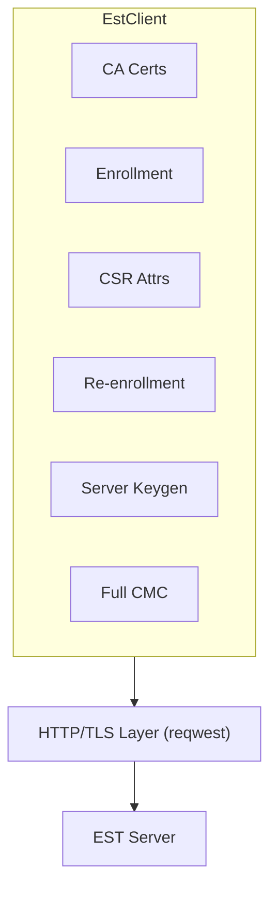

# usg-est-client Documentation

Welcome to the documentation for `usg-est-client`, an RFC 7030 compliant EST (Enrollment over Secure Transport) client library for Rust.

## Table of Contents

1. [Getting Started](getting-started.md) - Installation, setup, and quick start
2. [EST Operations](operations.md) - Detailed guide to all EST operations
3. [Configuration](configuration.md) - Configuring the EST client
4. [Security Considerations](security.md) - Security best practices and considerations
5. [API Reference](api-reference.md) - Complete API documentation
6. [Examples](examples.md) - Usage examples and patterns

## What is EST?

EST (Enrollment over Secure Transport) is a protocol defined in [RFC 7030](https://datatracker.ietf.org/doc/html/rfc7030) that enables automated certificate management over HTTPS. It provides a simple, standardized way for devices and applications to:

- Enroll for new certificates
- Renew/rekey existing certificates
- Retrieve CA certificates
- Query certificate signing requirements

## Key Features

- **RFC 7030 Compliant**: Full implementation of all mandatory and optional EST operations
- **Async-First**: Built on tokio for modern async/await workflows
- **Type-Safe**: Comprehensive Rust type system ensures correct usage
- **Secure**: TLS 1.2+ with rustls, support for client certificate authentication
- **Flexible**: Bootstrap/TOFU mode, HTTP Basic auth, custom trust anchors
- **Feature-Gated**: Optional CSR generation helpers to minimize dependencies
- **Well-Tested**: 39+ unit tests covering all operations

## Quick Example

```rust
use usg_est_client::{EstClient, EstClientConfig};

#[tokio::main]
async fn main() -> Result<(), Box<dyn std::error::Error>> {
    // Configure the client
    let config = EstClientConfig::builder()
        .server_url("https://est.example.com")?
        .build()?;

    // Create the client
    let client = EstClient::new(config).await?;

    // Get CA certificates
    let ca_certs = client.get_ca_certs().await?;
    println!("Retrieved {} CA certificates", ca_certs.len());

    Ok(())
}
```

## Supported EST Operations

| Operation | Endpoint | Description | Status |
|-----------|----------|-------------|--------|
| Distribution of CA Certificates | `GET /cacerts` | Retrieve CA certificates | ✅ Implemented |
| Simple Enrollment | `POST /simpleenroll` | Request new certificate | ✅ Implemented |
| Simple Re-enrollment | `POST /simplereenroll` | Renew/rekey certificate | ✅ Implemented |
| CSR Attributes | `GET /csrattrs` | Query CSR requirements | ✅ Implemented |
| Server-Side Key Generation | `POST /serverkeygen` | Server generates key pair | ✅ Implemented |
| Full CMC | `POST /fullcmc` | Complex PKI operations | ✅ Implemented |

## Architecture



## Project Structure

```text
usg-est-client/
├── src/
│   ├── lib.rs              # Public API exports
│   ├── client.rs           # Main EstClient implementation
│   ├── config.rs           # Configuration and builder
│   ├── error.rs            # Error types
│   ├── tls.rs              # TLS configuration
│   ├── bootstrap.rs        # Bootstrap/TOFU mode
│   ├── csr.rs              # CSR generation (feature-gated)
│   ├── operations/         # EST operation implementations
│   │   ├── cacerts.rs
│   │   ├── enroll.rs
│   │   ├── reenroll.rs
│   │   ├── csrattrs.rs
│   │   ├── serverkeygen.rs
│   │   └── fullcmc.rs
│   └── types/              # Message types and parsing
│       ├── pkcs7.rs
│       ├── csr_attrs.rs
│       └── cmc.rs
├── examples/               # Usage examples
│   ├── simple_enroll.rs
│   ├── reenroll.rs
│   └── bootstrap.rs
└── docs/                   # Documentation
    └── ...
```

## Building the documentation site (Zensical)

The static docs site is configured with `zensical.toml` and uses the Markdown files in this `docs/` directory.

1. Create a virtual environment and install Zensical:
   ```sh
   python3 -m venv .venv
   source .venv/bin/activate
   pip install zensical
   ```
2. Preview locally:
   ```sh
   zensical serve -f zensical.toml
   ```
   This starts a live-reload server at http://localhost:8000.
3. Build the static site:
   ```sh
   zensical build -f zensical.toml
   ```
   The generated site is written to `site/` (ignored from version control).

## License

This project is licensed under the Apache-2.0 license. See the LICENSE file for details.

## Contributing

Contributions are welcome! Please ensure all tests pass and add appropriate documentation for new features.

## Resources

- [RFC 7030 - EST Protocol](https://datatracker.ietf.org/doc/html/rfc7030)
- [RFC 5272 - CMC: Structures](https://datatracker.ietf.org/doc/html/rfc5272)
- [RFC 2986 - PKCS#10](https://datatracker.ietf.org/doc/html/rfc2986)
- [RFC 5652 - CMS](https://datatracker.ietf.org/doc/html/rfc5652)
