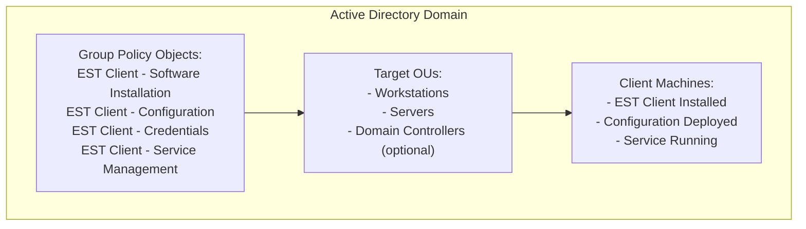
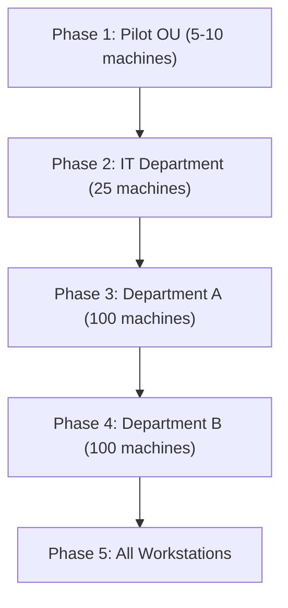
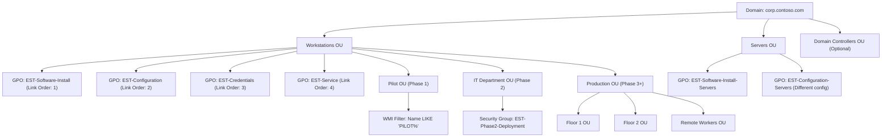

# Group Policy Deployment Guide

This guide covers deploying the EST client using Windows Group Policy in Active Directory environments.

## Table of Contents

1. [Overview](#overview)
2. [Prerequisites](#prerequisites)
3. [Deployment Strategy](#deployment-strategy)
4. [Software Distribution](#software-distribution)
5. [Configuration Deployment](#configuration-deployment)
6. [Credential Management](#credential-management)
7. [Service Configuration](#service-configuration)
8. [Monitoring and Reporting](#monitoring-and-reporting)
9. [Troubleshooting](#troubleshooting)
10. [Example GPO Structure](#example-gpo-structure)

## Overview

### Group Policy Capabilities

Group Policy can manage:

- **Software Installation**: Deploy MSI packages
- **Configuration Files**: Deploy config.toml via Preferences
- **Credentials**: Set environment variables or Credential Manager entries
- **Service Configuration**: Start/stop services, set startup type
- **Scheduled Tasks**: Trigger enrollment, renewal checks
- **Security Settings**: File permissions, firewall rules
- **Registry Settings**: Application configuration
- **Event Log Monitoring**: Centralized logging

### Deployment Architecture



## Prerequisites

### Active Directory

- Domain functional level: Windows Server 2012 R2 or higher
- Group Policy Management Console (GPMC) installed
- Administrative access to create and link GPOs

### File Shares

Create network shares for distribution:

```powershell
# Create share for software distribution
New-Item -ItemType Directory -Path "\\domain.com\SYSVOL\domain.com\EST" -Force
New-SmbShare -Name "EST" -Path "\\domain.com\SYSVOL\domain.com\EST" -ReadAccess "Domain Computers"

# Create directories
New-Item -ItemType Directory -Path "\\domain.com\SYSVOL\domain.com\EST\Software"
New-Item -ItemType Directory -Path "\\domain.com\SYSVOL\domain.com\EST\Config"
New-Item -ItemType Directory -Path "\\domain.com\SYSVOL\domain.com\EST\Certs"
```

### EST Client Package

Obtain or build the MSI installer:

```powershell
# Copy MSI to SYSVOL
Copy-Item "est-client-x64.msi" "\\domain.com\SYSVOL\domain.com\EST\Software\"

# Verify checksum
Get-FileHash "\\domain.com\SYSVOL\domain.com\EST\Software\est-client-x64.msi"
```

## Deployment Strategy

### Phased Rollout

Use OU structure and WMI filters for gradual deployment:



### GPO Linking Strategy

Create separate GPOs for modularity:

1. **EST-Software-Install**: Software deployment only
2. **EST-Configuration**: Config files and settings
3. **EST-Credentials**: Environment variables and credentials
4. **EST-Service**: Service management and monitoring

Link to appropriate OUs based on deployment phase.

## Software Distribution

### Create Software Installation GPO

#### **Step 1: Create GPO**

```powershell
# Create GPO
New-GPO -Name "EST-Software-Install" -Comment "EST Client Software Distribution"

# Link to Pilot OU
New-GPLink -Name "EST-Software-Install" -Target "OU=Pilot,OU=Workstations,DC=corp,DC=contoso,DC=com"
```

#### **Step 2: Configure Software Installation**

1. Open Group Policy Management Editor
2. Navigate to: `Computer Configuration → Policies → Software Settings → Software Installation`
3. Right-click → New → Package
4. Browse to: `\\domain.com\SYSVOL\domain.com\EST\Software\est-client-x64.msi`
5. Select "Assigned" deployment method
6. Click OK

#### **Step 3: Configure Installation Options**

Properties → Deployment:

- Deployment type: **Assigned**
- Deployment options:
  - [x] Auto-install this application by file extension activation
  - [x] Uninstall this application when it falls out of the scope of management
- Installation user interface options: **Basic**

Properties → Upgrades:

- Add previous version if performing upgrade
- Check "Upgrade over the existing package"

### MSI Command Line Parameters

For advanced installation options, configure via GPO:

Properties → Modifications → Advanced:

```sh
INSTALLDIR="C:\Program Files\EST Client"
ENABLE_LOGGING=1
START_SERVICE=1
```

### Verify Deployment

```powershell
# On client machine (after GPO refresh)
Get-WmiObject -Class Win32_Product | Where-Object {$_.Name -like "*EST*"}

# Or check installation directory
Test-Path "C:\Program Files\EST Client\est-enroll.exe"
```

## Configuration Deployment

### Prepare Configuration Files

#### **Step 1: Create Template Configuration**

```toml
# config-template.toml
[server]
url = "https://est.corp.contoso.com"

[trust]
mode = "explicit"
ca_bundle_path = "C:\\ProgramData\\EST\\ca-bundle.pem"

[authentication]
method = "http_basic"
username = "${COMPUTERNAME}$"
password_source = "env:EST_PASSWORD"

[certificate]
common_name = "${COMPUTERNAME}.${USERDNSDOMAIN}"
organization = "Contoso Corporation"
organizational_unit = "Workstations"

[certificate.san]
dns = ["${COMPUTERNAME}.${USERDNSDOMAIN}", "${COMPUTERNAME}"]

[certificate.key]
algorithm = "ecdsa-p256"
provider = "cng"
non_exportable = true

[certificate.extensions]
key_usage = ["digital_signature", "key_encipherment"]
extended_key_usage = ["client_auth"]

[renewal]
enabled = true
threshold_days = 45
check_interval_hours = 6

[storage]
windows_store = "LocalMachine\\My"
friendly_name = "EST Machine Certificate"

[logging]
level = "info"
windows_event_log = true

[service]
start_type = "automatic"
```

#### **Step 2: Copy to SYSVOL**

```powershell
Copy-Item "config-template.toml" "\\domain.com\SYSVOL\domain.com\EST\Config\config.toml"
Copy-Item "ca-bundle.pem" "\\domain.com\SYSVOL\domain.com\EST\Certs\ca-bundle.pem"
```

### Deploy via Group Policy Preferences

**Create Configuration GPO:**

```powershell
New-GPO -Name "EST-Configuration" -Comment "EST Client Configuration Files"
New-GPLink -Name "EST-Configuration" -Target "OU=Pilot,OU=Workstations,DC=corp,DC=contoso,DC=com"
```

**Configure File Copy via Preferences:**

1. Open GPMC → Edit "EST-Configuration"
2. Navigate to: `Computer Configuration → Preferences → Windows Settings → Files`
3. Right-click → New → File

**Configuration File:**

- Source: `\\domain.com\SYSVOL\domain.com\EST\Config\config.toml`
- Destination: `C:\ProgramData\EST\config.toml`
- Action: **Replace**

**CA Bundle:**

- Source: `\\domain.com\SYSVOL\domain.com\EST\Certs\ca-bundle.pem`
- Destination: `C:\ProgramData\EST\ca-bundle.pem`
- Action: **Replace**

**Set File Permissions:**

Navigate to: `Computer Configuration → Preferences → Windows Settings → Folders`

- Path: `C:\ProgramData\EST`
- Action: **Create**
- Attributes: Hidden
- Security:
  - SYSTEM: Full Control
  - Administrators: Full Control
  - Remove all other permissions

## Credential Management

### Method 1: Environment Variables (Simple)

**Create Credentials GPO:**

```powershell
New-GPO -Name "EST-Credentials" -Comment "EST Authentication Credentials"
New-GPLink -Name "EST-Credentials" -Target "OU=Pilot,OU=Workstations,DC=corp,DC=contoso,DC=com"
```

**Set Environment Variable:**

1. Navigate to: `Computer Configuration → Preferences → Windows Settings → Environment`
2. Right-click → New → Environment Variable
3. Configure:
   - Action: **Replace**
   - Name: `EST_PASSWORD`
   - Value: `<secure-password>`
   - User variable: **Unchecked** (system-wide)

**Security Consideration:** Environment variables are visible to all processes. For production, use Credential Manager or external secret management.

### Method 2: Windows Credential Manager (Secure)

**PowerShell Script via GPO:**

1. Create script: `Set-ESTCredentials.ps1`

```powershell
# Set-ESTCredentials.ps1
$username = "$env:COMPUTERNAME$"
$password = ConvertTo-SecureString "secure-password" -AsPlainText -Force

# Store in Credential Manager for SYSTEM account
$credential = New-Object System.Management.Automation.PSCredential($username, $password)

# Use cmdkey for persistent storage
cmdkey /generic:"EST-Enrollment" /user:$username /pass:"secure-password"
```

1. Deploy via GPO:
   - Navigate to: `Computer Configuration → Policies → Windows Settings → Scripts (Startup/Shutdown)`
   - Add script to Startup Scripts
   - PowerShell script: `\\domain.com\SYSVOL\domain.com\EST\Scripts\Set-ESTCredentials.ps1`

### Method 3: Retrieve from Secret Management System

**Integration with Azure Key Vault:**

```powershell
# Get-ESTPassword.ps1
# Run as startup script

# Authenticate to Azure (using managed identity)
Connect-AzAccount -Identity

# Get secret
$secret = Get-AzKeyVaultSecret -VaultName "contoso-keyvault" -Name "est-password"
$password = $secret.SecretValueText

# Set environment variable
[Environment]::SetEnvironmentVariable("EST_PASSWORD", $password, "Machine")
```

## Service Configuration

### Configure EST Service via GPO

**Create Service Management GPO:**

```powershell
New-GPO -Name "EST-Service" -Comment "EST Client Service Configuration"
New-GPLink -Name "EST-Service" -Target "OU=Pilot,OU=Workstations,DC=corp,DC=contoso,DC=com"
```

**Configure Service Startup:**

1. Navigate to: `Computer Configuration → Preferences → Control Panel Settings → Services`
2. Right-click → New → Service
3. Configure:
   - Service name: `EST-Enrollment`
   - Startup: **Automatic**
   - Service action: **Start service**
   - Recovery:
     - First failure: Restart the service
     - Second failure: Restart the service
     - Subsequent failures: Restart the service
     - Reset fail count after: 1 days

### Scheduled Task for Initial Enrollment

Create scheduled task to trigger first enrollment:

1. Navigate to: `Computer Configuration → Preferences → Control Panel Settings → Scheduled Tasks`
2. Right-click → New → Scheduled Task
3. Configure:
   - Name: `EST-Initial-Enrollment`
   - User: `SYSTEM`
   - Run whether user is logged on or not: **Checked**
   - Triggers: At system startup (delay 5 minutes)
   - Actions: Start program
     - Program: `C:\Program Files\EST Client\est-enroll.exe`
     - Arguments: `--enroll`
   - Conditions:
     - Start only if on AC power: **Unchecked**
     - Stop if switching to battery: **Unchecked**

## Monitoring and Reporting

### Event Log Forwarding

Configure Windows Event Forwarding:

**On Collector Server:**

```powershell
# Enable Windows Remote Management
Enable-PSRemoting -Force

# Configure Event Collector
wecutil qc /q

# Create subscription
wecutil cs est-enrollment-subscription.xml
```

**Subscription XML (est-enrollment-subscription.xml):**

```xml
<Subscription xmlns="http://schemas.microsoft.com/2006/03/windows/events/subscription">
  <SubscriptionId>EST-Enrollment-Events</SubscriptionId>
  <SubscriptionType>SourceInitiated</SubscriptionType>
  <Description>Collect EST enrollment events</Description>
  <Enabled>true</Enabled>
  <Query>
    <![CDATA[
    <QueryList>
      <Query Id="0">
        <Select Path="Application">
          *[System[Provider[@Name='EST-Enrollment']]]
        </Select>
      </Query>
    </QueryList>
    ]]>
  </Query>
</Subscription>
```

**On Client Machines (via GPO):**

1. Navigate to: `Computer Configuration → Policies → Administrative Templates → Windows Components → Event Forwarding`
2. Configure "Configure target Subscription Manager"
   - Server=<http://collector.corp.contoso.com:5985/wsman/SubscriptionManager/WEC,Refresh=60>

### Reporting via PowerShell

**Deployment Status Report:**

```powershell
# Get-ESTDeploymentStatus.ps1
$computers = Get-ADComputer -Filter * -SearchBase "OU=Workstations,DC=corp,DC=contoso,DC=com"
$report = @()

foreach ($computer in $computers) {
    $status = Invoke-Command -ComputerName $computer.Name -ScriptBlock {
        # Check if installed
        $installed = Test-Path "C:\Program Files\EST Client\est-enroll.exe"

        # Check service status
        $service = Get-Service EST-Enrollment -ErrorAction SilentlyContinue

        # Check certificate
        $cert = Get-ChildItem Cert:\LocalMachine\My |
                Where-Object {$_.FriendlyName -like "*EST*"} |
                Select-Object -First 1

        [PSCustomObject]@{
            Installed = $installed
            ServiceStatus = $service.Status
            CertExpires = $cert.NotAfter
            DaysRemaining = ($cert.NotAfter - (Get-Date)).Days
        }
    } -ErrorAction SilentlyContinue

    $report += [PSCustomObject]@{
        Computer = $computer.Name
        Installed = $status.Installed
        ServiceStatus = $status.ServiceStatus
        CertExpires = $status.CertExpires
        DaysRemaining = $status.DaysRemaining
    }
}

$report | Export-Csv "EST-Deployment-Report.csv" -NoTypeInformation
$report | Out-GridView
```

### Create Dashboard

Use PowerBI or Excel to visualize:

- Deployment progress (% installed)
- Certificate expiration timeline
- Enrollment success rate
- Service health status

## Troubleshooting

### GPO Not Applying

**Check GPO Status:**

```powershell
# On client machine
gpresult /H gpreport.html
gpresult /R

# Check specific GPO
Get-GPResultantSetOfPolicy -ReportType Html -Path "C:\gpreport.html"
```

**Force GPO Update:**

```powershell
gpupdate /force /boot
```

**Verify GPO Link:**

```powershell
Get-GPInheritance -Target "OU=Pilot,OU=Workstations,DC=corp,DC=contoso,DC=com"
```

### Software Installation Failures

**Check Application Event Log:**

```powershell
Get-EventLog -LogName Application -Source MsiInstaller -Newest 10
```

**Common Issues:**

1. **MSI not accessible**: Verify SYSVOL permissions
2. **Previous version conflict**: Configure upgrade in GPO
3. **Installation requires reboot**: Enable in MSI properties

### Configuration Not Deploying

**Verify File Copy:**

```powershell
# Check if file exists
Test-Path "C:\ProgramData\EST\config.toml"

# Check file content
Get-Content "C:\ProgramData\EST\config.toml"
```

**Check Group Policy Preferences:**

```powershell
# View applied preferences
Get-ItemProperty "HKLM:\SOFTWARE\Microsoft\Windows\CurrentVersion\Group Policy\History"
```

## Example GPO Structure

### Complete Organizational Structure



### GPO Settings Summary

**EST-Software-Install:**

- Computer Config → Software Installation → est-client-x64.msi
- Deployment: Assigned, Auto-install

**EST-Configuration:**

- Computer Config → Preferences → Files:
  - config.toml
  - ca-bundle.pem
- Computer Config → Preferences → Folders:
  - C:\ProgramData\EST (with ACLs)

**EST-Credentials:**

- Computer Config → Preferences → Environment Variables:
  - EST_PASSWORD
- Or Startup Script: Set-ESTCredentials.ps1

**EST-Service:**

- Computer Config → Preferences → Services:
  - EST-Enrollment (Automatic, Start)
- Computer Config → Preferences → Scheduled Tasks:
  - EST-Initial-Enrollment

## Security Best Practices

1. **Restrict GPO Editing**: Only Domain Admins
2. **Audit GPO Changes**: Enable auditing on GPO objects
3. **Secure SYSVOL**: Restrict access to distribution folders
4. **Encrypt Passwords**: Never store plaintext in GPO
5. **Use Secure Channels**: Configure WinRM over HTTPS for Event Forwarding
6. **Regular Review**: Audit applied GPOs quarterly

## Additional Resources

- [Group Policy Planning and Deployment Guide](https://docs.microsoft.com/en-us/previous-versions/windows/it-pro/windows-server-2008-R2-and-2008/cc754948(v=ws.10))
- [Windows Event Forwarding](https://docs.microsoft.com/en-us/windows/security/threat-protection/use-windows-event-forwarding-to-assist-in-intrusion-detection)
- [Configuration Reference](../config-reference.md)
- [Migration from ADCS](../migration-from-adcs.md)
