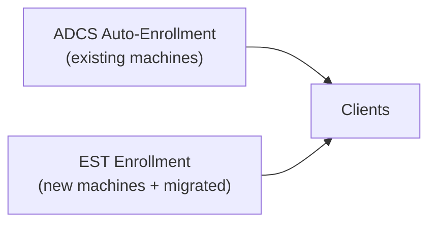
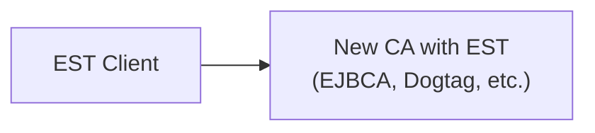

# Migration from ADCS to EST

This guide provides step-by-step instructions for migrating from Microsoft Active Directory Certificate Services (ADCS) auto-enrollment to EST-based certificate enrollment.

## Table of Contents

1. [Overview](#overview)
2. [Prerequisites](#prerequisites)
3. [Migration Strategy](#migration-strategy)
4. [Phase 1: Assessment](#phase-1-assessment)
5. [Phase 2: Infrastructure Setup](#phase-2-infrastructure-setup)
6. [Phase 3: Pilot Deployment](#phase-3-pilot-deployment)
7. [Phase 4: Gradual Rollout](#phase-4-gradual-rollout)
8. [Phase 5: Full Migration](#phase-5-full-migration)
9. [Certificate Template Mapping](#certificate-template-mapping)
10. [Authentication Mapping](#authentication-mapping)
11. [Common Migration Scenarios](#common-migration-scenarios)
12. [Rollback Procedures](#rollback-procedures)
13. [Post-Migration Validation](#post-migration-validation)

## Overview

### Why Migrate from ADCS?

| ADCS Limitation | EST Advantage |
|-----------------|---------------|
| Windows-only clients | Cross-platform support |
| Requires Active Directory | Works standalone |
| Proprietary MS-WCCE protocol | Standards-based (RFC 7030) |
| Complex Group Policy setup | Simple configuration files |
| Windows server infrastructure | Any EST-capable CA |
| Limited HSM options | PKCS#11 HSM support |

### Migration Scope

This guide covers migration of:

- **Machine certificates** (computer authentication)
- **Server certificates** (web servers, RDP, etc.)
- **User certificates** (optional, if using certificate-based auth)

## Prerequisites

### EST Server Requirements

- EST server supporting RFC 7030
- CA capable of issuing X.509 certificates
- Network connectivity from clients to EST server (HTTPS)

**Compatible EST Servers:**

- EJBCA Enterprise
- Dogtag Certificate System (FreeIPA)
- Cisco EST
- DigiCert PKI Platform
- Custom EST server implementations

### Client Requirements

- EST client software installed
- Configuration files deployed
- Network access to EST server

### Administrative Requirements

- Certificate template documentation from ADCS
- Current enrollment statistics
- Service account credentials for EST
- CA certificates for trust anchors

## Migration Strategy

### Phased Approach (Recommended)

```text
Week 1-2:    Assessment & Planning
Week 3-4:    Infrastructure Setup
Week 5-6:    Pilot Deployment (5-10%)
Week 7-8:    Expanded Pilot (10-25%)
Week 9-12:   Gradual Rollout (25-75%)
Week 13-16:  Full Migration (75-100%)
Week 17+:    ADCS Decommissioning (optional)
```

### Parallel Operation Period

Run both systems in parallel during migration:



## Phase 1: Assessment

### 1.1 Document Current ADCS Configuration

**Certificate Templates Inventory:**

```powershell
# List all certificate templates
certutil -CATemplates

# Export template details
Get-CATemplate | Export-Csv -Path ".\templates.csv"
```

Record for each template:

- Template name and OID
- Subject name format (CN, SAN requirements)
- Key usage and extended key usage
- Key algorithm and size
- Validity period
- Enrollment permissions

**Enrollment Statistics:**

```powershell
# Count certificates issued by template
$templates = Get-CATemplate
foreach ($template in $templates) {
    $count = Get-IssuedRequest -Filter "CertificateTemplate -eq '$($template.Name)'"
    Write-Host "$($template.Name): $count certificates"
}
```

### 1.2 Map Templates to EST Configuration

**ADCS Template → EST Configuration Mapping:**

| ADCS Field | EST Configuration |
|------------|-------------------|
| Template Name | `ca_label` (if using multi-CA) |
| Subject Name Format | `[certificate]` section |
| Key Usage | `[certificate.extensions].key_usage` |
| Extended Key Usage | `[certificate.extensions].extended_key_usage` |
| Key Size/Algorithm | `[certificate.key].algorithm` |
| Validity Period | Controlled by EST server |
| SAN | `[certificate.san]` section |

### 1.3 Identify Dependencies

Document systems that depend on ADCS certificates:

- Web servers (IIS, Apache, nginx)
- Remote Desktop Services
- VPN/DirectAccess
- 802.1X network authentication
- S/MIME email
- Code signing
- Smart card logon

## Phase 2: Infrastructure Setup

### 2.1 Deploy EST Server

#### **Option A: Use Existing CA with EST Front-End**


#### **Option B: Migrate to New CA**



### 2.2 Configure Trust Anchors

Export CA certificate chain:

```powershell
# From ADCS (if using same root CA)
certutil -ca.cert ca-cert.pem

# Or from new CA
openssl s_client -connect est.example.com:443 -showcerts < /dev/null 2>/dev/null | \
  openssl x509 -outform PEM > ca-bundle.pem
```

### 2.3 Create EST Service Account

Create authentication credentials:

```powershell
# Create service account in AD
New-ADServiceAccount -Name "est-enroll" -DNSHostName "est.example.com"

# Or create local account on EST server
# Configure in EST server with enrollment permissions
```

### 2.4 Prepare Configuration Templates

Create configuration file templates for each certificate type:

**Machine Certificate Template:**

```toml
# machine-cert.toml
[server]
url = "https://est.example.com"

[trust]
mode = "explicit"
ca_bundle_path = "${PROGRAMDATA}\\EST\\ca-bundle.pem"

[authentication]
method = "http_basic"
username = "${COMPUTERNAME}$"
password_source = "env:EST_PASSWORD"

[certificate]
common_name = "${COMPUTERNAME}.${USERDNSDOMAIN}"
organization = "Your Organization"

[certificate.san]
dns = ["${COMPUTERNAME}.${USERDNSDOMAIN}", "${COMPUTERNAME}"]

[certificate.key]
algorithm = "ecdsa-p256"
provider = "cng"
non_exportable = true

[certificate.extensions]
key_usage = ["digital_signature", "key_encipherment"]
extended_key_usage = ["client_auth"]

[renewal]
enabled = true
threshold_days = 45

[storage]
windows_store = "LocalMachine\\My"
friendly_name = "Machine Certificate (EST)"

[logging]
level = "info"
windows_event_log = true
```

## Phase 3: Pilot Deployment

### 3.1 Select Pilot Group

Choose 5-10 machines for initial testing:

- Different hardware types
- Different Windows versions
- Different network segments
- Non-critical systems

### 3.2 Deploy to Pilot Group

#### **Step 1: Install EST Client**

```powershell
# Deploy via SCCM, GPO, or manually
msiexec /i est-client.msi /quiet

# Verify installation
est-enroll --version
```

#### **Step 2: Deploy Configuration**

```powershell
# Create configuration directory
New-Item -ItemType Directory -Path "C:\ProgramData\EST" -Force

# Copy configuration
Copy-Item .\config.toml "C:\ProgramData\EST\config.toml"

# Copy CA bundle
Copy-Item .\ca-bundle.pem "C:\ProgramData\EST\ca-bundle.pem"
```

#### **Step 3: Set Credentials**

```powershell
# Via Group Policy Preferences (recommended)
# Or via environment variable
[Environment]::SetEnvironmentVariable("EST_PASSWORD", "secure-password", "Machine")
```

#### **Step 4: Validate Configuration**

```powershell
est-enroll --validate-config
```

#### **Step 5: Test Enrollment**

```powershell
# Manual enrollment
est-enroll --enroll --verbose

# Check certificate
Get-ChildItem Cert:\LocalMachine\My | Where-Object {$_.FriendlyName -like "*EST*"}
```

### 3.3 Disable ADCS Auto-Enrollment for Pilot

For pilot machines, disable ADCS auto-enrollment:

```powershell
# Remove from auto-enrollment GPO
Remove-ADGroupMember -Identity "ADCS-AutoEnroll" -Members "PILOT-PC01$"

# Or use WMI filter in GPO
```

### 3.4 Monitor and Validate

**Check Certificate Validity:**

```powershell
$cert = Get-ChildItem Cert:\LocalMachine\My | Where-Object {$_.FriendlyName -like "*EST*"}
$cert | Select-Object Subject, NotAfter, Issuer
```

**Verify Application Functionality:**

- Test RDP connections
- Test network authentication (802.1X)
- Test VPN connections
- Verify no application errors

## Phase 4: Gradual Rollout

### 4.1 Expand to Larger Groups

Create deployment groups:

| Group | Size | Timeline | Criteria |
|-------|------|----------|----------|
| Wave 1 | 10% | Week 7 | Low-risk workstations |
| Wave 2 | 25% | Week 8 | Standard workstations |
| Wave 3 | 50% | Week 10 | All workstations |
| Wave 4 | 75% | Week 12 | Servers (non-critical) |
| Wave 5 | 100% | Week 14 | All systems |

### 4.2 Automation for Deployment

**PowerShell Deployment Script:**

```powershell
param(
    [string]$TargetOU = "OU=Workstations,DC=corp,DC=contoso,DC=com"
)

# Get computers in target OU
$computers = Get-ADComputer -SearchBase $TargetOU -Filter *

foreach ($computer in $computers) {
    Write-Host "Deploying to $($computer.Name)..."

    # Copy files
    $dest = "\\$($computer.Name)\C$\ProgramData\EST"
    New-Item -ItemType Directory -Path $dest -Force
    Copy-Item ".\config.toml" "$dest\config.toml"
    Copy-Item ".\ca-bundle.pem" "$dest\ca-bundle.pem"

    # Trigger enrollment
    Invoke-Command -ComputerName $computer.Name -ScriptBlock {
        & "C:\Program Files\EST\est-enroll.exe" --enroll
    }
}
```

### 4.3 Coexistence with ADCS

During migration, machines may have both ADCS and EST certificates:

```powershell
# View all machine certificates
Get-ChildItem Cert:\LocalMachine\My | Select-Object Subject, FriendlyName, Issuer

# Output:
# Subject                    FriendlyName              Issuer
# -------                    ------------              ------
# CN=DESKTOP-ABC123.corp...  Machine Certificate       CN=ADCS-CA...
# CN=DESKTOP-ABC123.corp...  Machine Certificate (EST) CN=EST-CA...
```

**Certificate Selection Priority:**

Applications typically use the certificate based on:

1. Template/EKU matching
2. Validity period (most recent)
3. Explicit binding (IIS, RDP)

Configure application bindings to use EST certificates:

```powershell
# IIS
$estCert = Get-ChildItem Cert:\LocalMachine\My | Where-Object {$_.FriendlyName -like "*EST*"}
New-IISSiteBinding -Name "Default Web Site" -BindingInformation "*:443:" -CertificateThumbprint $estCert.Thumbprint -CertificateStoreName "My"
```

## Phase 5: Full Migration

### 5.1 Complete Rollout

After successful gradual rollout:

1. Deploy EST client to remaining systems
2. Verify enrollment on all systems
3. Update monitoring for EST certificates

### 5.2 Disable ADCS Auto-Enrollment

#### **Option A: Disable GPO**

```powershell
# Disable the auto-enrollment GPO
Set-GPLink -Name "Certificate Auto-Enrollment" -Target "DC=corp,DC=contoso,DC=com" -LinkEnabled No
```

#### **Option B: Modify GPO Settings**

In Group Policy Editor:

1. Computer Configuration → Windows Settings → Security Settings → Public Key Policies
2. Set "Certificate Services Client - Auto-Enrollment" to "Disabled"

### 5.3 Clean Up Old Certificates

After successful migration and validation:

```powershell
# Remove old ADCS certificates (optional)
$oldCerts = Get-ChildItem Cert:\LocalMachine\My | Where-Object {
    $_.Issuer -like "*ADCS-CA*" -and
    $_.FriendlyName -notlike "*EST*"
}

foreach ($cert in $oldCerts) {
    Write-Host "Removing old certificate: $($cert.Subject)"
    # Remove-Item $cert.PSPath  # Uncomment to actually remove
}
```

## Certificate Template Mapping

### Workstation Authentication

**ADCS Template:**

```text
Template Name: Workstation Authentication
Subject Name: Built from AD
Key Usage: Digital Signature
Enhanced Key Usage: Client Authentication (1.3.6.1.5.5.7.3.2)
Key Size: 2048
```

**EST Configuration:**

```toml
[certificate]
common_name = "${COMPUTERNAME}.${USERDNSDOMAIN}"

[certificate.key]
algorithm = "ecdsa-p256"  # Or "rsa-2048" for compatibility

[certificate.extensions]
key_usage = ["digital_signature"]
extended_key_usage = ["client_auth"]
```

### Web Server

**ADCS Template:**

```text
Template Name: Web Server
Subject Name: Supply in request
Key Usage: Digital Signature, Key Encipherment
Enhanced Key Usage: Server Authentication (1.3.6.1.5.5.7.3.1)
Key Size: 2048
```

**EST Configuration:**

```toml
[certificate]
common_name = "www.example.com"

[certificate.san]
dns = ["www.example.com", "example.com"]

[certificate.key]
algorithm = "rsa-2048"

[certificate.extensions]
key_usage = ["digital_signature", "key_encipherment"]
extended_key_usage = ["server_auth"]
```

### Smart Card Logon

**ADCS Template:**

```text
Template Name: Smartcard Logon
Subject Name: Built from AD (UPN)
Key Usage: Digital Signature
Enhanced Key Usage: Smart Card Logon (1.3.6.1.4.1.311.20.2.2), Client Auth
Key Size: 2048
```

**EST Configuration:**

```toml
[certificate]
common_name = "${USERNAME}@${USERDNSDOMAIN}"

[certificate.san]
email = ["${USERNAME}@${USERDNSDOMAIN}"]

[certificate.key]
algorithm = "rsa-2048"
provider = "tpm"  # Or smart card

[certificate.extensions]
key_usage = ["digital_signature"]
extended_key_usage = ["smart_card_logon", "client_auth"]
```

## Authentication Mapping

### ADCS to EST Authentication

| ADCS Method | EST Method | Configuration |
|-------------|------------|---------------|
| Kerberos (machine account) | HTTP Basic | `username = "${COMPUTERNAME}$"` |
| NTLM | HTTP Basic | `username`, `password_source` |
| Certificate | Client Certificate | `cert_store` or `cert_path` |
| Enrollment Agent | Not applicable | Use service account |

### Machine Account Authentication

ADCS uses Kerberos with machine account. EST typically uses HTTP Basic:

```toml
[authentication]
method = "http_basic"
# Use machine account style username
username = "${COMPUTERNAME}$"
password_source = "credential_manager"  # Or env:EST_PASSWORD
```

### Transitioning to Certificate Authentication

After initial enrollment, switch to certificate-based re-enrollment:

```toml
[authentication]
method = "auto"  # Tries client_cert first, falls back to http_basic

# Initial enrollment uses HTTP Basic
username = "${COMPUTERNAME}$"
password_source = "env:EST_PASSWORD"

# Re-enrollment uses the EST-issued certificate
cert_store = "LocalMachine\\My"
cert_thumbprint = "auto"  # Automatically selects matching certificate
```

## Common Migration Scenarios

### Scenario 1: Standalone Workstations

Machines not domain-joined:

```toml
[server]
url = "https://est.example.com"

[trust]
mode = "explicit"
ca_bundle_path = "C:\\EST\\ca-bundle.pem"

[authentication]
method = "http_basic"
username = "${COMPUTERNAME}"
password_source = "file:C:\\EST\\credentials.txt"

[certificate]
common_name = "${COMPUTERNAME}.standalone.example.com"

[storage]
windows_store = "LocalMachine\\My"
```

### Scenario 2: Multi-Forest Environment

Machines in different AD forests:

```toml
[server]
url = "https://est.corp.example.com"
ca_label = "forest-a"  # Use different CA labels per forest

[certificate]
# Include forest identifier in DN
common_name = "${COMPUTERNAME}.${USERDNSDOMAIN}"
organizational_unit = "Forest-A"
```

### Scenario 3: DMZ Servers

Servers without domain connectivity:

```toml
[server]
url = "https://est-dmz.example.com"

[trust]
mode = "explicit"
ca_bundle_path = "/etc/est/ca-bundle.pem"

[authentication]
method = "http_basic"
username = "dmz-server-001"
password_source = "file:/etc/est/credentials"

[certificate]
common_name = "dmz-server-001.dmz.example.com"

[certificate.san]
dns = ["dmz-server-001.dmz.example.com"]
ip = ["10.0.1.100"]
```

### Scenario 4: IoT/Embedded Devices

Constrained devices:

```toml
[server]
url = "https://est.iot.example.com"
timeout_seconds = 30

[trust]
mode = "explicit"
ca_bundle_path = "/opt/device/ca.pem"

[authentication]
method = "http_basic"
username = "${DEVICE_SERIAL}"
password_source = "file:/opt/device/credentials"

[certificate]
common_name = "${DEVICE_SERIAL}.iot.example.com"

[certificate.key]
algorithm = "ecdsa-p256"
provider = "tpm"

[renewal]
enabled = true
threshold_days = 14
check_interval_hours = 24

[logging]
level = "warn"
```

## Rollback Procedures

### Immediate Rollback (Single Machine)

```powershell
# Re-enable ADCS auto-enrollment
gpupdate /force

# Trigger ADCS enrollment
certreq -machine -enroll

# Disable EST service
Stop-Service EST-Enrollment
Set-Service EST-Enrollment -StartupType Disabled
```

### Group Rollback

```powershell
# Re-enable ADCS GPO
Set-GPLink -Name "Certificate Auto-Enrollment" -Target "OU=Workstations,..." -LinkEnabled Yes

# Force group policy update
Invoke-GPUpdate -Computer $computers -Force

# Disable EST on affected machines
$computers | ForEach-Object {
    Invoke-Command -ComputerName $_ -ScriptBlock {
        Stop-Service EST-Enrollment -ErrorAction SilentlyContinue
        Set-Service EST-Enrollment -StartupType Disabled -ErrorAction SilentlyContinue
    }
}
```

### Full Rollback

1. Re-enable ADCS auto-enrollment GPO for all OUs
2. Force group policy update domain-wide
3. Verify ADCS enrollment succeeds
4. Disable/uninstall EST client
5. Remove EST certificates (optional)
6. Document lessons learned

## Post-Migration Validation

### Validation Checklist

- [ ] All machines have valid EST certificates
- [ ] Certificate renewal is working
- [ ] Applications function correctly (RDP, VPN, 802.1X)
- [ ] Monitoring detects certificate issues
- [ ] Logging captures enrollment events
- [ ] Help desk trained on new system

### Monitoring Queries

**Certificate Expiration Report:**

```powershell
$computers = Get-ADComputer -Filter * -Properties *
$report = @()

foreach ($computer in $computers) {
    $cert = Invoke-Command -ComputerName $computer.Name -ScriptBlock {
        Get-ChildItem Cert:\LocalMachine\My |
        Where-Object {$_.FriendlyName -like "*EST*"} |
        Select-Object Subject, NotAfter, Thumbprint
    } -ErrorAction SilentlyContinue

    $report += [PSCustomObject]@{
        Computer = $computer.Name
        Subject = $cert.Subject
        Expires = $cert.NotAfter
        DaysRemaining = ($cert.NotAfter - (Get-Date)).Days
    }
}

$report | Where-Object {$_.DaysRemaining -lt 30} | Export-Csv "expiring-certs.csv"
```

**Event Log Monitoring:**

```powershell
# EST enrollment events
Get-WinEvent -LogName "Application" -FilterXPath "*[System[Provider[@Name='EST-Enrollment']]]" |
Select-Object TimeCreated, Id, Message |
Export-Csv "est-events.csv"
```

### Success Metrics

| Metric | Target | Measurement |
|--------|--------|-------------|
| Enrollment Success Rate | > 99% | EST events / total machines |
| Renewal Success Rate | > 99.9% | Renewed / due for renewal |
| Certificate Validity | 100% | Machines with valid certs |
| Migration Coverage | 100% | EST certs / total machines |
| MTTR (Mean Time to Resolve) | < 1 hour | Issue detection to resolution |

## Additional Resources

- [Windows Enrollment Guide](windows-enrollment.md)
- [Configuration Reference](config-reference.md)
- [Troubleshooting Guide](troubleshooting.md)
- [Security Considerations](security.md)
- [RFC 7030 - EST Protocol](https://tools.ietf.org/html/rfc7030)
